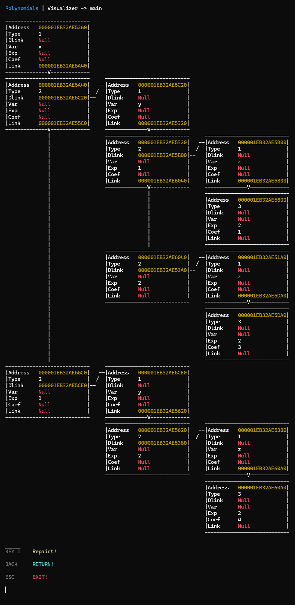
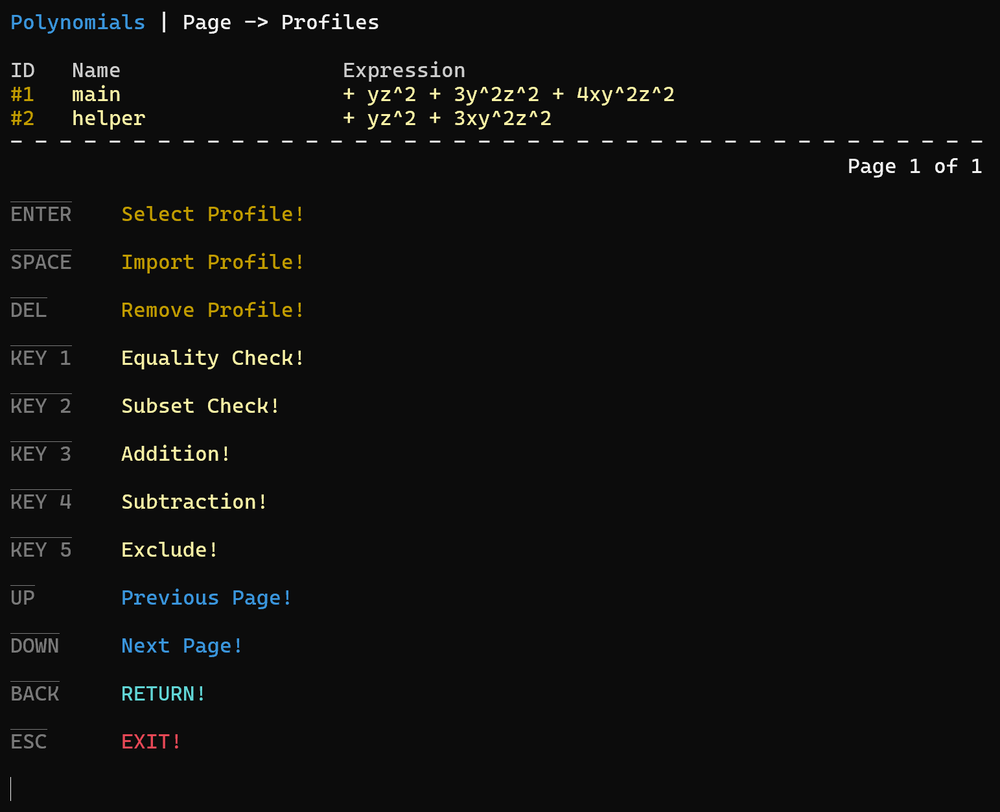
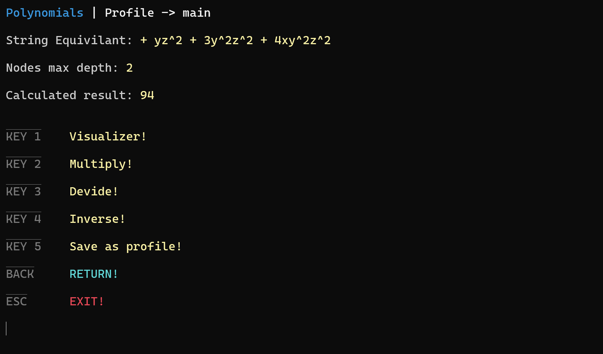
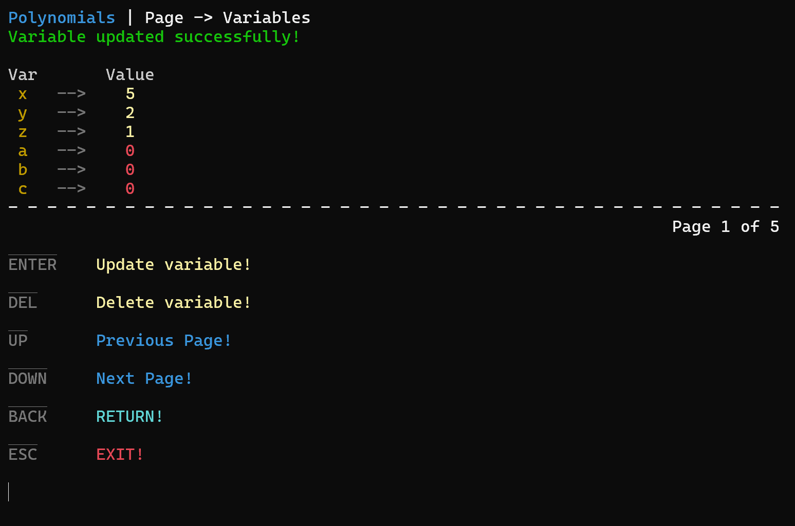

# Complex Lists of Polynomials

## 🎉 Prepare to Be Amazed!

Welcome to Complex Lists of Polynomials—a project designed to handle polynomial expressions like never before! If you thought polynomials were simple, this project takes them to a whole new level of complexity and functionality.

## 🚀 Capabilities

Profile Management: Create, manipulate, and manage profiles of polynomial expressions effortlessly.

Advanced Visualizations: Explore polynomial data with interactive visualizations(first pic).

Arithmetic Operations: Add, subtract, and multiply polynomials with ease.

Subset Validation: Check if one polynomial profile is a subset of another.

Dynamic Configuration: Update and toggle configurations on the fly.

Customizable Variables: Manage and modify variables seamlessly.

## 🧩 Key Features

Interactive Console UI: Navigate through profiles, variables, and settings in a user-friendly console interface.

File Support: Import polynomials from files and save profiles effortlessly.

Equality Checks: Verify if two polynomial profiles are equal.

Error Handling: Get instant feedback on invalid inputs and actions.

Subset Operations: Extract or validate subsets of polynomial profiles.

## 📚 How to Use

Home Interface:

Navigate between Profiles, Variables, and Settings.

Profiles:

Create new profiles.

Perform operations like addition, subtraction, and exclusion.

Save profiles for future use.

Variables:

Add, update, or delete variables dynamically.

Settings:

Toggle configurations based on your needs.

## 💡 Why It’s Unique

This project isn’t just about handling polynomials—it’s about redefining how we interact with them. Whether you’re exploring complex datasets, performing high-level computations, or simply experimenting, Complex Lists of Polynomials offers unmatched power and flexibility.

Get ready to dive into the world of polynomials like never before! 🌟

